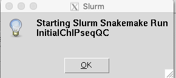
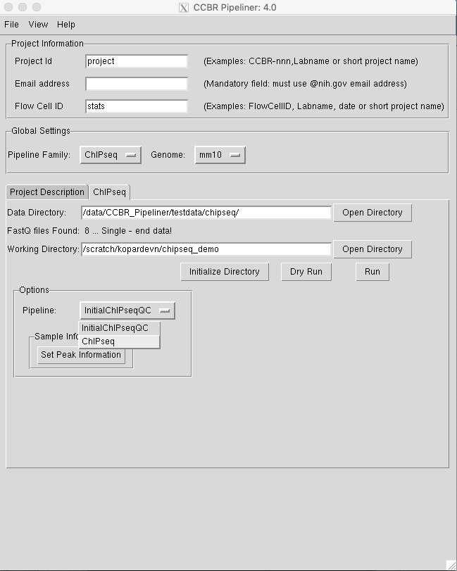

This page is the main source of documentation for users that are getting started with the ChIP-seq pipeline. Please check out our [pipeline resources](https://github.com/CCBR/Pipeliner/wiki/ChIP-seq-pipeline-tools-and-versions) page for a comprehensive listing of supported reference genomes and different tools the (with version information) pipeline employs.

**If you are a new user**, we recommend following our [Tutorial](https://github.com/CCBR/Pipeliner/wiki/ChIP-seq#tutorial) with the provided test data set on Biowulf. If you are a new user and you would like to skip our guided tutorial, please see our [quick start section](https://github.com/CCBR/Pipeliner/wiki/TLDR-ChIP-seq#quick-start). 

### Getting started with the Quality-control pipeline

This section provides step-by-step instructions for setting up the first pipeline (Quality-control pipeline) and a brief description of the pipeline's output files and directories. We assume that you have already successfully launched the GUI. If not, please see [Launch Pipeliner](https://github.com/CCBR/Pipeliner/wiki/TLDR-RNA-seq#quick-start). Also, in order to use CCBR_Pipeliner on [biowulf](https://hpc.nih.gov), you will need an active biowulf account which can be requested [here](https://hpc.nih.gov/docs/accounts.html).

### **About the Demo Dataset** 

For the purposes of this demo we have chosen a subset of a publicly available dataset from GEO ([GSE76478](https://www.ncbi.nlm.nih.gov/geo/query/acc.cgi?acc=GSE76478)). The origin datasets contains CTCF and H3K27ac ChIP-seq experimental data at early and late stages in iPS cells. Here we will focus on the following samples:

| GSM number | SRR number | Sample                     | Cell type                                                    |
| ---------- | ---------- | -------------------------- | ------------------------------------------------------------ |
| GSM2026234 | SRR3081748 | CTCF_ChIP_macrophage_p20_1 | macrophage derived induced pluripotent stem cells after 20 passages |
| GSM2026235 | SRR3081749 | CTCF_ChIP_macrophage_p20_2 | macrophage derived induced pluripotent stem cells after 20 passages |
| GSM2026236 | SRR3081750 | CTCF_ChIP_macrophage_p3_1  | macrophage derived induced pluripotent stem cells after 3 passages |
| GSM2026237 | SRR3081751 | CTCF_ChIP_macrophage_p3_2  | macrophage derived induced pluripotent stem cells after 3 passages |
| GSM2026238 | SRR3081752 | CTCF_ChIP_MEF_p20_1        | mouse embryonic fibroblasts derived induced pluripotent stem cells after 20 passages |
| GSM2026239 | SRR3081753 | CTCF_ChIP_MEF_p20_2        | mouse embryonic fibroblasts derived induced pluripotent stem cells after 20 passages |
| GSM2026258 | SRR3081772 | WCE_p3                     | whole cell extract after 3 passages                          |
| GSM2026259 | SRR3081773 | WCE_p20                    | whole cell extract after 20 passages                         |

The raw fastq files were downloaded from SRA using the [sra toolkit](https://hpc.nih.gov/apps/sratoolkit.html)

```bash
> ls /data/CCBR_Pipeliner/testdata/chipseq/*fastq.gz
/data/CCBR_Pipeliner/testdata/chipseq/SRR3081749_1.fastq.gz
/data/CCBR_Pipeliner/testdata/chipseq/SRR3081750_1.fastq.gz
/data/CCBR_Pipeliner/testdata/chipseq/SRR3081751_1.fastq.gz
/data/CCBR_Pipeliner/testdata/chipseq/SRR3081752_1.fastq.gz
/data/CCBR_Pipeliner/testdata/chipseq/SRR3081753_1.fastq.gz
/data/CCBR_Pipeliner/testdata/chipseq/SRR3081772_1.fastq.gz
/data/CCBR_Pipeliner/testdata/chipseq/SRR3081773_1.fastq.gz
```

This is single-ended sequencing dataset, hence we have one fastq file per sample. Single-ended (SE) sequencing is the preferred sequencing choice for ChIP-seq data, but CCBR_Pipeliner does accept paired-end (PE) data. In case of PE data, each sample will have two fastq files of raw data, namely, a *Read1* and a *Read2*, generally denoted by *R1* and *R2*. Please note that, *R1* and *R2* in the context of PE data, do not represent two different replicates as this is the most common source of confusion for most novice NGS data analysts.

The SRA filenames do not comply with our [file naming convention](). There are three possible ways to fix this:

1. Rename the files with CCBR_Pipeliner compliant names
2. Create symbolic links at a different location and rename the symbolic links with CCBR_Pipeliner compliant filenames
3. Add a tab-delimited file called **labels.txt** in the same folder as the raw data. This file has 2 columns:
   * First column denotes the current name of the file, and
   * Second column is the what the corresponding CCBR_Pipeliner compliant name should be.

Here, we are going to use option 3. The **labels.txt** file looks something like this:

```bash
SRR3081748_1.fastq.gz	CTCF_ChIP_macrophage_p20_1.R1.fastq.gz
SRR3081749_1.fastq.gz	CTCF_ChIP_macrophage_p20_2.R1.fastq.gz
SRR3081750_1.fastq.gz	CTCF_ChIP_macrophage_p3_1.R1.fastq.gz
SRR3081751_1.fastq.gz	CTCF_ChIP_macrophage_p3_2.R1.fastq.gz
SRR3081752_1.fastq.gz	CTCF_ChIP_MEF_p20_1.R1.fastq.gz
SRR3081753_1.fastq.gz	CTCF_ChIP_MEF_p20_2.R1.fastq.gz
SRR3081772_1.fastq.gz	WCE_p3_input.R1.fastq.gz
SRR3081773_1.fastq.gz	WCE_p20_input.R1.fastq.gz
```

### **Phase 1: Initial QC**

Before you can run the QC portion of the ChIP-seq pipeline, there are a few key pieces of information that must be provided.

#### **Step 0. Fill out the `Project Information` section**  

This section contains three fields: `Project Id`, `Email address`, `Flow Cell ID`. For this demo, you can set _Project Id_ to `project`. This will be the name of the pipeline's master job. Please enter your email address in the `Email address` field. You may leave `Flow cell ID` blank for now.

#### **Step 1. Setting `Pipeline`**

Under the `Pipeline Family` select `ChIPSeq`. Once `ChIPSeq` pipeline is selected a new tab should appear next to `Project Description`.


#### **Step 2. Select `Genome`**

Next select the genome to choose `mm10` as this is *Mus musculus* data. Although many genome options show up in the `Genome` drop down only the following four are supported by the ChIP-seq pipeline.

| Genome | Organism (assembly) |
| ------ | ------------------- |
| hg19   | Human (GRCh37)      |
| hg38   | Human (GRCh38)      |
| mm9    | Mouse (GRCm37)      |
| mm10   | Mouse (GRCm38)      |

If any other genome is selected from the drop-down, then a pop-up will give a warning and will prevent you from proceeding with your analysis.


> _**Please Note:**_ If you select a reference genome that is not supported by the pipeline, a pop-up box will notify you.

#### **Step 3. Select your Data Directory**  

If you are following along with this tutorial, you can use the included demo dataset. Please select the **`Open Directory`** button and navigate to the following path on biowulf's filesystem in the pop-up box:  

```
/data/CCBR_Pipeliner/testdata/chipseq/
```


> _**Please Note:**_ Input files will be read from and output files will be written to the biowulf filesystem. If your rawdata does not exist on biowulf, then you may need to upload it there first. Output files can be downloaded from biowulf to your local computer for downstream analysis.

Once you have pointed to or navigated to the directory above, select **`OK`**. You should receive a message that 8 single end files were found:


Click OK.

#### **Step 4. Select your Working Directory**  

You are now ready to select your working directory on biowulf's filesystem. This is where all of the pipeline's output files will be created. In this tutorial, I set the working directory to `/scratch/demo/chipseq` by clicking the `Open Directory` button in front of `Working Directory` and then navigating the my directory of choice. But, you could set it to another location like `/scratch/<yourUserName>/chipseq_demo`. The only pre-requisites are that

* this directory should **not** exist.
* this directory should **not** be a sub-directory of CCBR pipeliner *working dir* from a previous run.

The process very similar to the previous step except, you will point to a directory that does not exist on the biowulf filesystem by typing in the directory name, as it will be created in the next step. 


> _**Please Note:**_ Input files will be read from and output files will be written to the biowulf filesystem. If you rawdata does not exist on biowulf, then you may need to upload it there first. Output files can be downloaded from biowulf to your local computer for downstream analysis.


#### **Step 5. Initialize your Working Directory**   

In this step, we will initialize or create the Working Directory defined in the step above. Please select the **`Initialize Directory`** button. During this step, the required resources to run the pipeline are copied into the working directory. After a few moments, you should receive a notification stating the directory was successfully initialized:


Click Ok.

If the directory already exists or you do not have write permissions, then you will get a warning like this:


#### **Step 6. Set Peak information**

Under `Options`, `InitialChIPseqQC`is selected by default. Click the `Set Peak Information` button, to pop-up another window, where you can specify which samples are *ChIP* samples and which samples should be used as their corresponding *Input* samples:


* Select all the ChIP samples in the *ChIP Names* column. 
* For each ChIP sample, select the matching control sample (Input, IgG control, mock, no tag control, or WCE) in the *Input Names* column. Inputs can be paired to more than one ChIP sample. Leave as N/A if there is no control match for a ChIP sample. 
* Type a *Group Name* for each ChIP sample or select from the pull-down list in the rightmost column. Each ChIP sample must have a Group Name. Replicates should be given the same Group Name. Group names should only contain alphanumeric characters (No spaces, hyphens, dashes, etc.), but underscores are okay. 
* Click `Save` button once done and close the popup. This will save this information as *peakcall.tab* file in the *work directory*. Here we created three groups, namely **mac_p20**, **map_p3** and **mef_p20**. Each of these groups have 2 replicates each denoted by the `_1` and `_2` in the file basenames.
* You can also save the three columns, ie, **ChIP Names**, **Input Names** and **Group Names** as a tab-delimited file in the *work directory*, name it *peakcall.tab* and load the predefined file using the `Load` button.

#### **Step 7. Perform Dry Run**

Click on the `Dry Run` button to check if the initial QC phase tasks and the pipeline is configured properly. A successful dry run will display all tasks to be run and will have a job counts table at the top and bottom of the popup.  This step take about 10-20 seconds to run, so please be patient until another window pops up with DAG information:


If there is no error in the `Dry Run`, then you are ready to proceed.

#### **Step 8. Run**

Close the `Dry Run` popup and click the `Run` button. In a few seconds, you will see another popup:



Once you click `OK`button on the popup, the job is submitted to the [slurm queue](https://hpc.nih.gov/docs/userguide.html) on biowulf.

### Check progress

You can check status of the jobs submitted using the HPC [dashboard](https://hpc.nih.gov/dashboard/). If you are comfortable using the command line, you can use `squeue` or `sjobs` command to monitor jobs submitted to *slurm*. Please refer *slurm* [documentation](https://hpc.nih.gov/docs/userguide.html) for details.

### Confirm successful completion of Phase 1.

In the *work directory*, look for a file name *HPC_usage_table.txt*, which lists details about all submitted jobs. This file doesn't appear until the job is finished. Here are columns in this tab-delimited file:

```bash
1 JobName
2 Jobid
3 Partition
4 State
5 Nodes
6 CPUs
7 Walltime
8 Runtime
9 MemReq
10 MemUsed
11 Nodelist
12 MaxCPUUsed
13 Queuetime
14 CPUHours
15 Account
16 Username
```

This file can be open in Microsoft Excel for easy viewing. Examine the values under the column **Status** . The values can be **COMPLETED**. or **FAILED**. If no **FAILED** values are found and all values are **COMPLETED**, then Phase 1 has finished running successfully and you are ready to move to phase 2. 

### **Phase 2: Peak calling, differential peak calling, annotations, and motif searches**  

Phase 1 will take a few hours to run. It is important to know that the second phase of the ChIP-seq Pipeliner can only be run after successful completion of initialQC phase. This workflow is to be executed in the same working directory (e.g.`/scratch/<yourUserName>/chipseq_demo`) as that specified in the InitialQC phase, so that the pipeline can identify the output files from the InitialQC run, that are being used as input files to the differential expression workflow.   

#### Step 1. Initial Setup

Repeat steps 0 through 3 from Phase 1. Also enter the *work directory* to the same folder selected in Step 4 of Phase 1, the only difference is that the *work directory* should already exist with Phase 1 results in it.

#### Step 2. Select Pipeline Options

From `Options` select `ChIPseq` `Pipeline` from the dropdown.



#### Step 3. Set contrasts (Optional)

If you wish to compare peaks between groups after peakcalling, then you can specify the contrasts that need to be performed here. Click `Set Groups to compare peaks`


This will popup another window where you can select the groups to compare. Here, each row denoted a different comparison, ie, an independent instance of differential peak analysis using *DiffBind*.


Clicking `Save` button creates a *contrast.tab* file in the *work directory*. If you are familiar with creating and editing file at the command line, then you can also create a tab-delimited file with the name *contrast.tab* in the *work directory* in order to set the contrasts without using the GUI interface. The *contrast.tab* looks like this:

```bash
Macrophage_p3	Macrophage_p20
MEF_p20	Macrophage_p20
```

Here, we have specified two contrasts trying to compare the peaks in the groups *Macrophage_p3* and *MEF_p20* with respect to the peaks in group *Macrophage_p20*.

#### Step 4. Perform Dry Run

Close the previous popup and then, click on the `Dry Run` button to check if the phase2 tasks and the pipeline is configured properly. A successful dry run will display all tasks to be run and will have a job counts table at the top and bottom of the popup. This step take about 10-20 seconds to run, so please be patient until another window pops up with DAG information:


If there is no error in the `Dry Run` , as seen in the truncated snapshot above, then you are ready to proceed.

#### **Step 5. Run**

Close the `Dry Run` popup and click the `Run` button on the main GUI. In a few seconds, you will see another popup:


Once you click `OK`button on the popup, the job is submitted to the [slurm queue](https://hpc.nih.gov/docs/userguide.html) on biowulf.

### Check progress

You can check status of the jobs submitted using the HPC [dashboard](https://hpc.nih.gov/dashboard/). If you are comfortable using the command line, you can use `squeue` or `sjobs` command to monitor jobs submitted to *slurm*. Please refer *slurm* [documentation](https://hpc.nih.gov/docs/userguide.html) for details. You can also use the *HPC_usage_table.txt* as we did in Phase 1.
