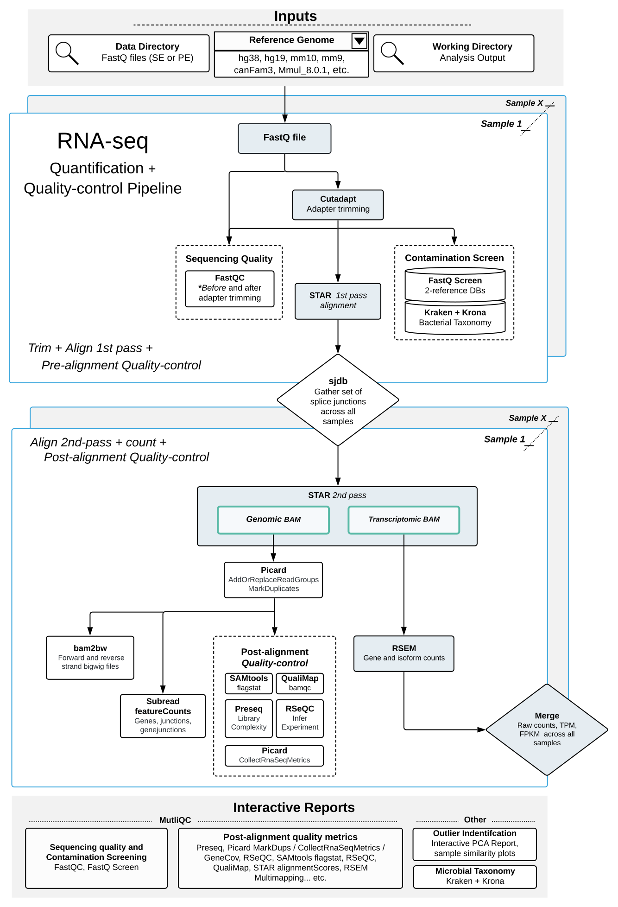
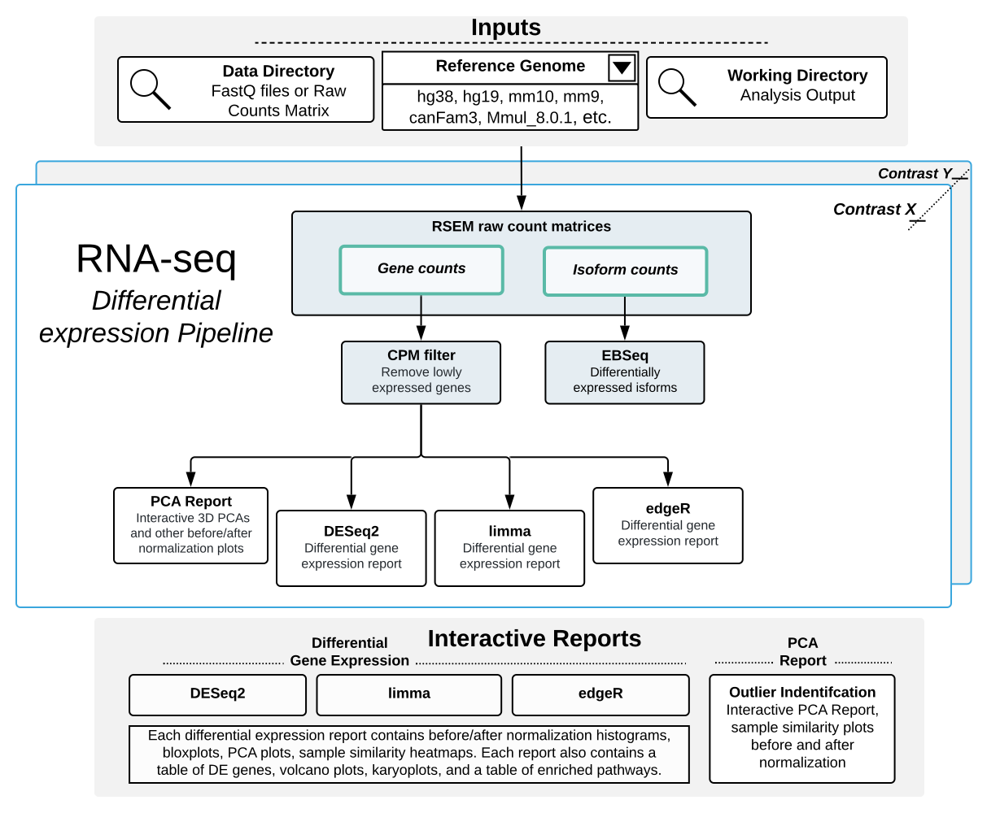

# Gene and isoform expression pipelines

## Overview
This page is the main source of documentation for users that are getting started with the RNA-seq expression pipeline. If you are not familiar with RNA-seq, please checkout our [theory and practical guide](Theory-and-practical-guide-for-RNA-seq.md). That section provides a conceptual overview to RNA-seq analysis and as well as a set of generalized guidelines for different quality-control metrics.  

Our [resources page](Differential-expression-pipeline-tools-and-versions.md) contains more information about the pipeline's supported reference genomes along with every tool the pipeline employs.

**If you are a new user**, we recommend following our [guided tutorial](Gene-and-isoform-expression-pipeline#tutorial) with the provided test data set on Biowulf. If you are a new user and you would like to skip our guided tutorial, please see our [quick start section](TLDR-RNA-seq.md#quick-start).

The RNA-seq expression workflow is composed of two phases (or pipelines). In the first pipeline, gene and isoform expression are quantified and pre- and post- alignment QC is performed. In the second pipeline, differential expression analysis is performed. In both pipelines, a series of interactive reports are generated to allow a user to explore their results. Both pipelines support the following reference genomes:  

**Human** `hg19` `hg38` `hg38_30` `hs37d5` `hs38d1` `hg38_30`  
**Human + _Integrated Virus_** `hg38_30_KSHV` `hg38_HPV16`  
**Mouse** `mm10` `mm9` `mm10_M21`  
**Canine** `canFam3`  
**Rhesus macaque** `Mmul_8.0.1`

## Quantification and quality-control pipeline

In the first pipeline, the sequencing quality of each sample is independently assessed using FastQC, Preseq, Picard tools, RSeQC, SAMtools, and QualiMap. FastQ Screen and Kraken + Krona are used to screen for various sources of contamination. Adapter sequences are removed using Cutadapt prior to mapping to the user-selected reference genome. STAR is run in a two-pass mode where splice-junctions are collected and aggregated across all samples and provided to the second-pass of STAR. Gene and isoform expression levels are quantified using RSEM and subread. The expected counts from RSEM are merged across samples to create a two counts matrices for genes and isoforms.

 **Fig 1. An Overview of the Quantification and Quality-control Pipeline.** Gene and isoform counts are quantified and a series of QC-checks are performed to assess the quality of the data. This pipeline stops at the generation of a raw counts matrix, which is input to the next sub-workflow. To run the pipeline, a user must select their raw data directory (i.e. the location to their FastQ files), a reference genome, and output directory (i.e. the location where the pipeline performs the analysis). Quality-control information is summarized across all samples in the MultiQC report.

## Differential Expression pipeline

In the second step, the count matrices from RSEM are filtered to remove low count genes (i.e. `[CPM < 0.5] >=  X samples`) prior to differential expression analysis. The filtered raw gene count matrix is normalized, and differential expression analysis is performed between user-defined groups of samples (i.e. contrasts) using three different methods: DESeq2, limma, and edgeR. Enriched pathways are identified via `l2p` over-representation test using gene sets from the Molecular Signatures Database.

> _**Please note:**_ As input, this sub-workflow will accept the raw counts matrix generated in the first step (i.e. RNA-seq quantification and quality-control pipeline), or it will accept a user-provided raw counts matrix.

 **Fig 2. An overview of the Differential Expression Pipeline.** Three different methods (Deseq2, limma, and edgeR) are employed to find differentially expressed genes for each user-defined contrast. EBSeq is used to find differentially expressed isoforms. A PCA report containing before and after normalization plots (using DESeq2, limma, and edgeR) is generated for each contrast.

