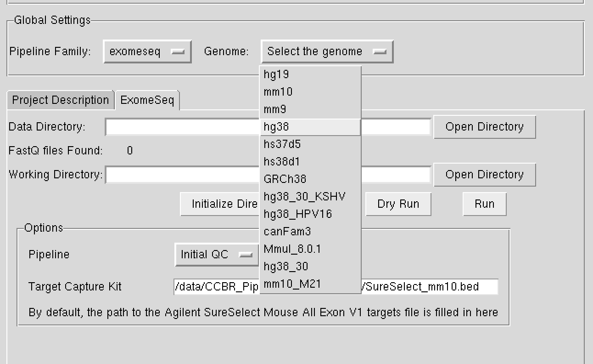
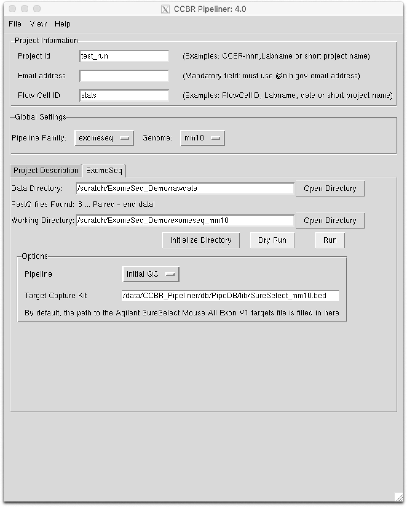
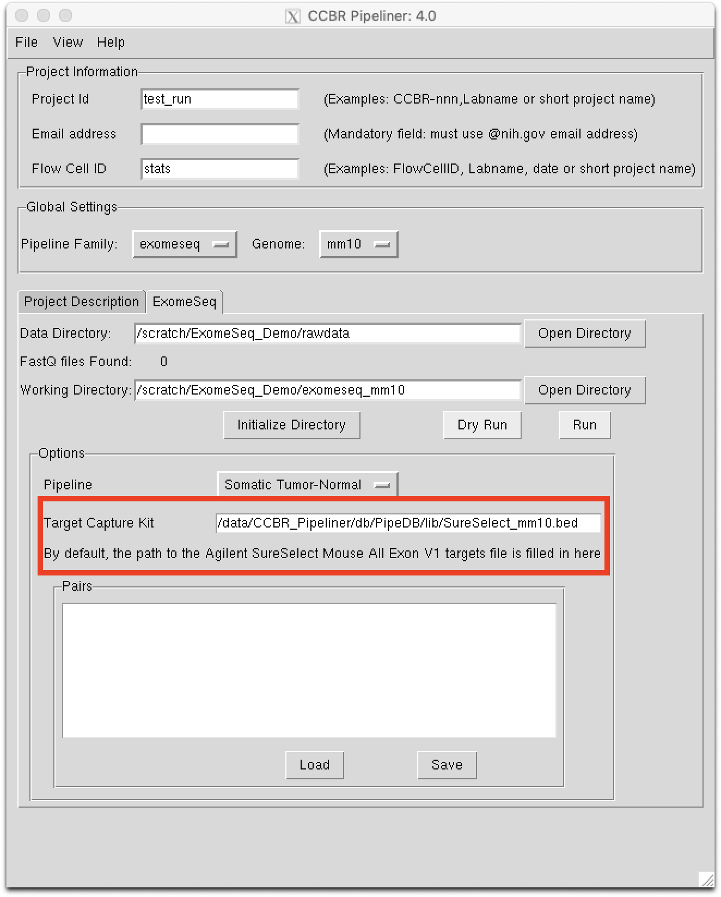
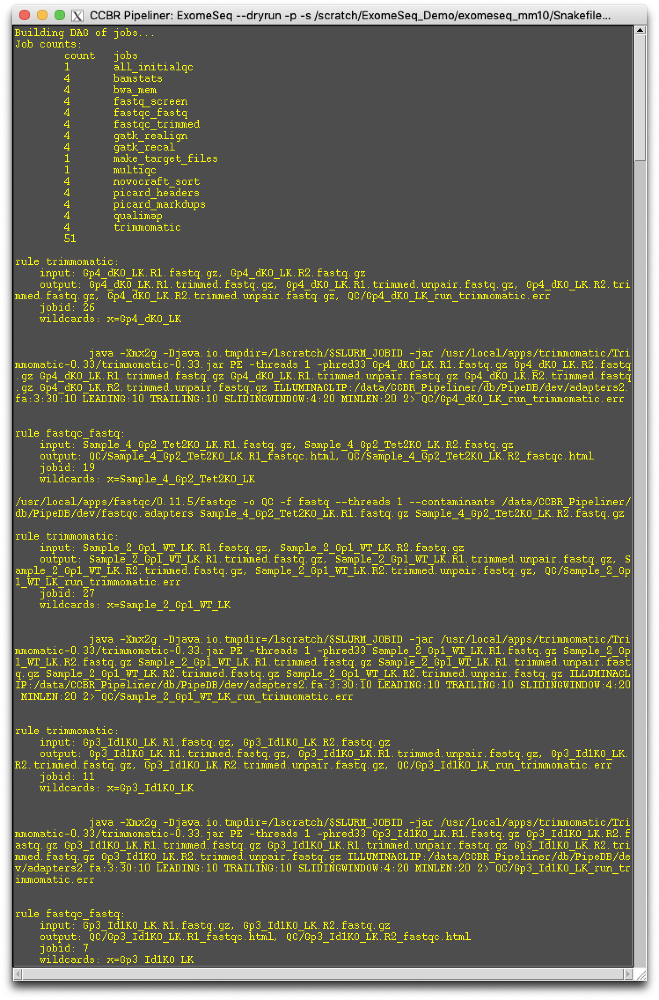
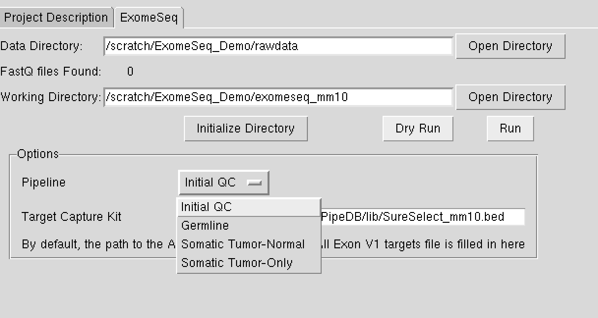
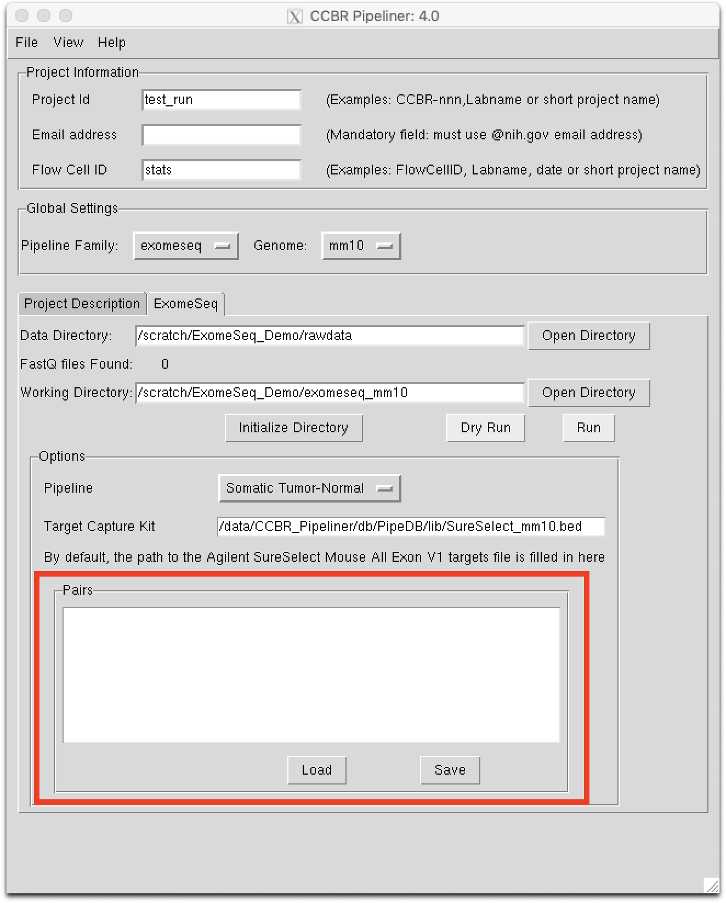

# WES/WGS Quick Start
## Launch Pipeliner
The RNA-Seq documentation contains a good guide on [starting the Pipeliner GUI](https://ccbr.github.io/pipeliner-docs/RNA-seq/TLDR-RNA-seq/#launch-pipeliner)

## Select Pipeline
From the "*Pipeline Family*" dropdown menu, select `exomeseq` or `genomeseq`, depending on the type of sequencing, and then select the genome.

Currently only `hg19`, `hg38`, and `mm10` are supported.

<p float="left" align="center">
  
</p>


## Provide Data Paths
The RNA-Seq documentation has a handy table of rules for [naming raw data files](https://ccbr.github.io/pipeliner-docs/RNA-seq/TLDR-RNA-seq/#rules-for-naming-raw-data-files) and a more detailed guide for [setting up the raw data](https://ccbr.github.io/pipeliner-docs/RNA-seq/TLDR-RNA-seq/#setup-pipeliner)

- In the "*Data Directory*" input box, enter the full path of the folder that contains your raw, gzipped, paired-end FASTQ files.  You can use the "*Open Directory*" button to browse through the filesystem to locate the directory, or type in the path manually.
    - The CCBR Tools repo also contains a [bash script](https://github.com/CCBR/Tools/blob/master/Biowulf/make_labels_for_pipeliner.sh) to automatically create a `labels.txt` file.
- In the "*Working Directory*" input box, enter the full path of the folder to which the output will be stored.  You can use the "*Open Directory*" button to browse through the filesystem to locate the directory, or type in the path manually.


Here's an example of what the GUI should look like when filled out:
<p float="left" align="center">
  
</p>

## Run `Intial QC`
For all exome and genome pipelines, workflows consist of 2 stages: Initial QC and variant calling. The initialQC portion of the workflow MUST ALWAYS BE EXECUTED TO COMPLETION BEFORE VARIANT CALLING.

- When first running the Initial QC pipeline, click on the "*Initialize Directory*" button.
- For EXOME analysis, you must provide the full path to the exome targets bed file in the area highlighted below.  Please check with the sequencing facility or the manufacturer of the exome capture kit for this file.
<p float="left" align="center">
  
</p>
- If there are no errors, click on the "*Dry Run*" button.  This may take several minutes if you have a large number of input files.
- Inspect the Dry Run output.  It should show a tally of the rules that will be executed and details of each step for each file, like this:
<p float="left" align="center">
  
</p>


## Run variant calling
Pipeliner supports three types of variant calling: `Germline`, `Somatic Tumor-Normal`, or `Somatic Tumor-only`.
<p float="left" align="center">
  
</p>

Once `Initial QC` is completed, setup the Pipeliner options exactly as before, and in the Pipeline dropdown, select one of the variant calling pipelines.

For the `tumor-normal` pipeline, the sample pairing must be specified for each pair in the area highlighted below.
<p float="left" align="center">
  
</p>

When you specify 'Somatic Tumor-Normal' in the Pipeline dropdown menu of the Options box, a 'Pairs' text input area will appear (marked in red above). Inside that window, you can write in the pairs, with each pair on a separate line, the normal sample in the first column, the tumor sample in the second column, and with a tab separating the columns.

For example, if the fastq files for the tumor sample are named `Sample_1_tumor.R[1,2].fastq.gz` and the matched normal is `Sample_1_normal.R[1,2].fastq.gz`, the pairs file would look like this:
```
Sample_1_normal Sample_1_tumor
```

## Track Progress
Within the GUI, set up the fields exactly as you did above when you started the pipeline, but instead of initializing, select 'Progress' from the 'View' menu at the top of the GUI. This will generate a workflow, with the the completed steps in colored circles, and the incomplete steps in gray.

Alternatively, you can simply read the last line of the 'snakemake.log' file in the 'Reports' directory within the working directory. This file is written to every time a job is submitted or completed, giving you information concerning the % jobs completed, as well as any error messages describing failed jobs.

The CCBR Tools repo also contains a [bash script](https://github.com/CCBR/Tools/blob/master/Biowulf/get_slurm_file_with_error.sh) to parse the `snakemake.log` file and determine the slurm job IDs and logs that likely contain the error(s).

Finally, we also provide a [bash script](https://github.com/CCBR/Tools/blob/master/Biowulf/cancel_snakemake_jobs.sh) to cancel slurm jobs listed in a snakemake log file.  This is helpful when you have multiple Pipeliner runs going on, and you want to selectively cancel one of them (at a time).

