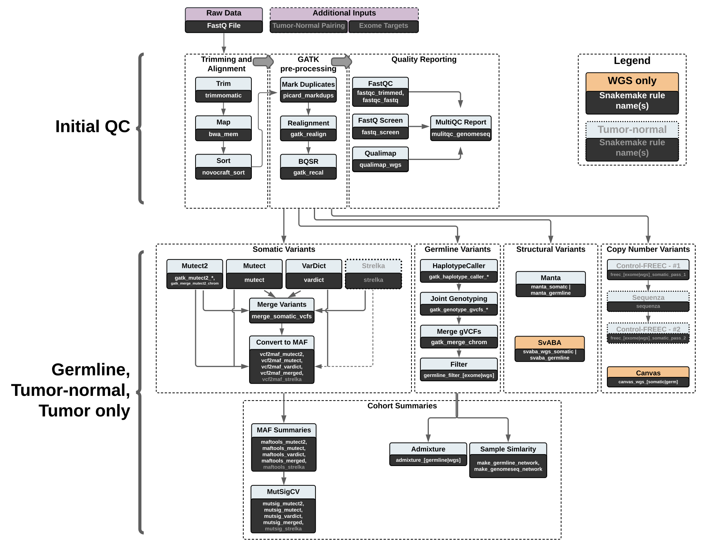

# Whole genome and exome pipelines

## Overview
This section offers an introduction to the Whole Exome Sequencing (WES) and Whole Genome Sequencing (WGS) pipelines available in CCBR Pipeliner, an overview of the workflows, and details of the QC and variant calling outputs.

WES and WGS require different considerations and implementations, but they are conceptually similar.  **Figure 1** below describes the workflow, highlighting differences between WGS and WES, as well as tumor-normal or tumor only.

Both the WES and WGS pipelines can be run in `germline`, `tumor only`, or `tumor-normal` modes.

## Workflow Summary
 **Fig 1. An Overview of the Whole Genome/Exome Pipelines.**

For detailed descriptions of the individual tools outlined in the WES workflows, refer to the specific tool's documentation and web sites (tools are listed [here](../Whole-exome-genome-tools-and-versions)).

