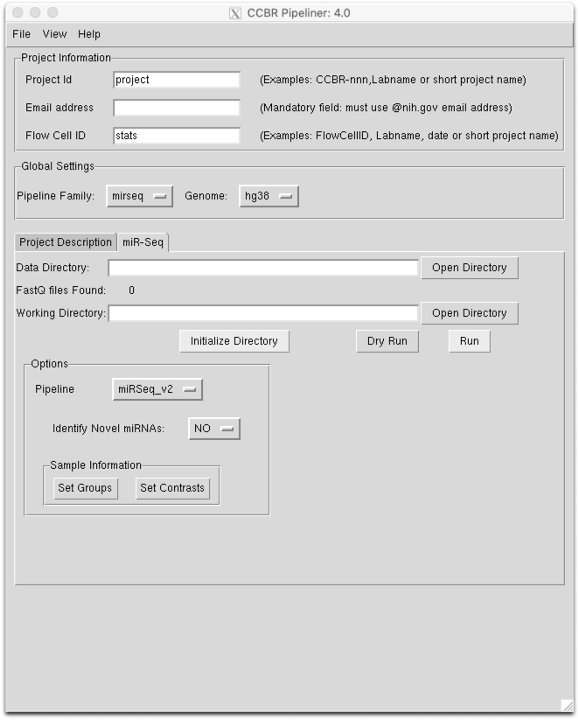
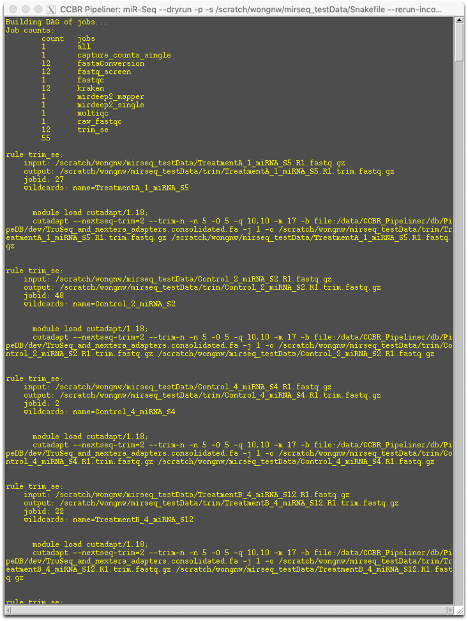
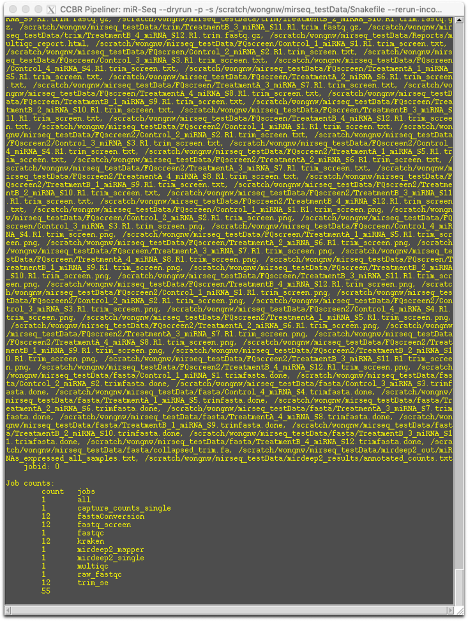
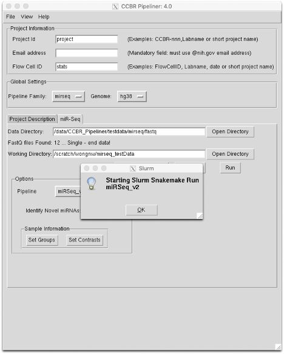

## Setup

In the rawData directory, create a directory to contain all the FASTQ files. Navigate to the directory and create softlinks or hardlinks for the fastq.gz files (absolute file path is recommended) . Follow the naming conventions as described in the [RNA-Seq documentation](https://github.com/CCBR/Pipeliner/wiki/TLDR-RNA-seq#rules-for-naming-raw-data-files). In short:

* Use the format: `<sampleName>.R1.fastq.gz`
* <u>Do not use spaces</u> in the sample name.
* <u>Do not use hyphens or minus signs</u> in the sample name (i.e. `-`) 
* <u>Do not</u> start sample names with a <u>number</u>
* <u>Do not use the terms</u> `sample`, `R1`, or `R2` in the sample name itself.
* You may use underscores in the filename (i.e. `_`)

In the GUI, follow standard usage to select the miRSeq pipeline and the organism genome of interest. Current supported genomes are hg38 (human) and mm10 (mouse). Create the working directory as normal and "Initialize Directory." If set up properly, symlinks to the fastq.gz files should be created in the working directory.



## Initial Quality Control

The most up-to-date version of the miRSeq pipeline is labeled `miRSeq_v2.` Do not use the `CAPmirseq-plus` pipeline, as it is no longer maintained.

### Novel miRNA identification

By default, miRDeep2 initially performs alignment of reads to a known microRNA sequence reference, such as those available at [miRBase.org](http://www.mirbase.org). In addition, miRDeeps offers the option to perform identification of novel microRNAs by mapping reads to the reference genome and determining the likelihood of genuine precursor and mature miRNA sequences through folding energy. These calculations can be time- and memory-intensive, but should the user be interested in novel miRNA discovery, we have maintained the ability to perform this function.

### Setting up sample sheets

**groups.tab**

As before, the groups.tab file lists the sample file headers, indicates the group to which each sample belongs, and allows the user to create an alias for the sample. For examples, if there are four samples in two groups, with the file names `Sample1.R1.fastq.gz`,  Sample2.R1.fastq.gz`,etc. `groups.tab` would contain the following:

```
Sample1    Group1    S1
Sample2    Group2    S2
Sample3    Group1    S3
Sample4    Group2    S4
```

**contrasts.tab**

The `contrasts.tab` file contains the comparisons to be made by differential expression, along with information associated with normalizing across samples. The file consists of four columns, with the first two columns indicating groups to be compared, followed by the minimum read count and the minimum number of samples for a miRNA to be accepted (i.e. <u>not</u> filtered for low expression). To continue the previous example, to compare Group2-Group1, with a minimum read count of 0.5 in at least 2 samples, `contrasts.tab` would contain the following:

```
Group2    Group1    0.5      2
```

### Dry-running the Pipeline

After setting up the data directory, the working directory, the `groups.tab` file, and the `contrasts.tab` file, click the `Dry Run` button. This will launch a preliminary pipeline check to ensure that all necessary files are present and accessible. A new window will open showing the steps that will be run in the pipeline. Scroll to the end of the dry run to confirm that the process names and number of processes run are identical at the beginning and end.

|Top of Dry Run|End of Dry Run|
|--------------|--------------|
| ||

### Run the miRSeq Pipeline

If the dry run checks out, click the `Run` button. This produces the following popup:



Click `OK` to launch the pipeline. Users will be notified by email when the run is completed.
