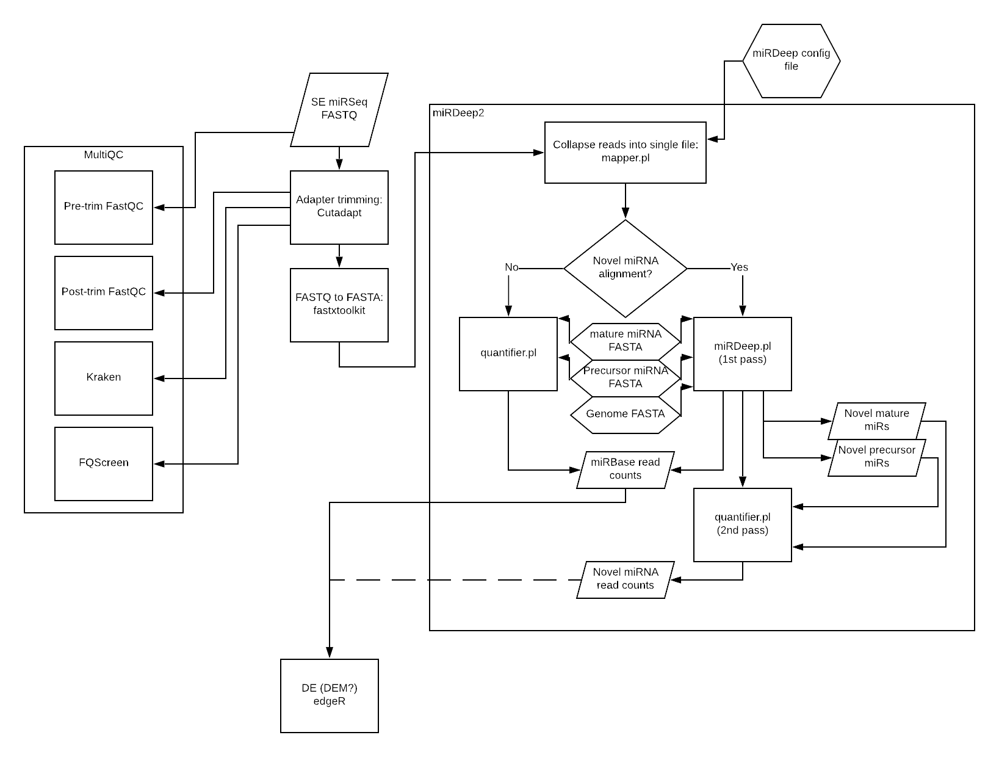

# miRNA-seq Pipeline

## Overview 
An end-to-end pipeline for miRSeq, beginning from raw single-end FASTQ files and ending with differential expression. The alignment is performed using miRDeep2 and differential expression with EdgeR, first by creating a generalized linear model (GLM) and performing a likelihood ratio test (LRT).

