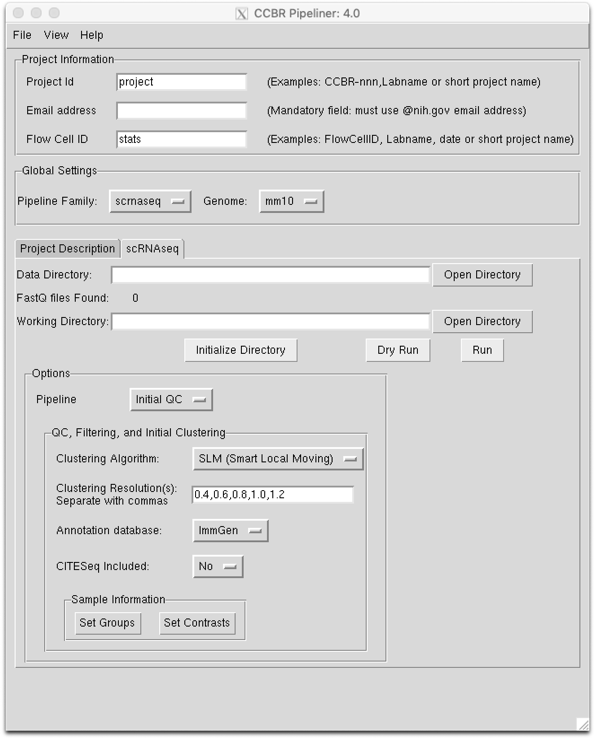
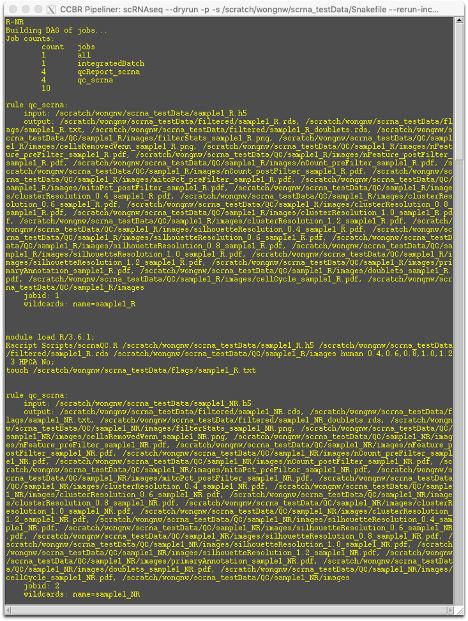
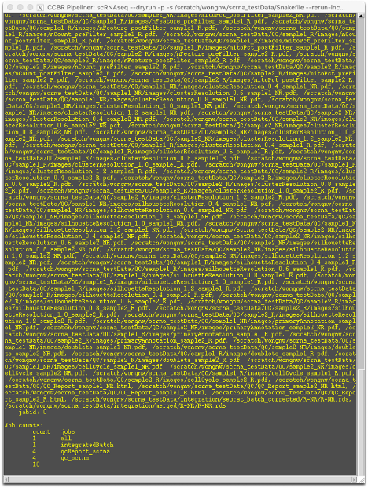
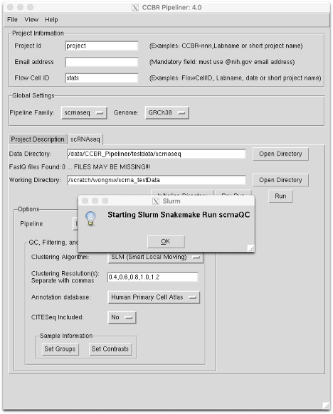

## Setup

In the rawData directory for the project, create a directory titled “h5”. Navigate to the directory and create softlinks for the h5 files (absolute file path is generally helpful). 

In the GUI, follow the standard usage to select the scRNASeq pipeline and an organism genome of interest. Current supported genomes are GRCh38 (human) and mm10 (mouse).


Set the data directory the parent directory <ins>**containing**</ins> the h5 directory, <ins>**not**</ins> the h5 directory directly.  Create the working directory as normal and “Initialize Directory”. If set up properly, symlinks to the h5 files should be created within the working directory.

### Initial Quality Control

#### Clustering
The clustering algorithm can be chosen from one of three options:
1. Smart Local Moving Algorithm (default)
2. Original Louvain algorithm
3. Louvain algorithm with multilevel refinement

Multiple clustering resolutions can be used, ranging from 0 to 2, where lower resolution values will result in larger and fewer clusters. The default values of 0.4, 0.6, 0.8, 1.0, and 1.2 should cover the majority of clustering resolutions necessary. 

#### Cell Type Annotation
The [annotation databases provided by SingleR](https://bioconductor.org/packages/devel/bioc/vignettes/SingleR/inst/doc/SingleR.html#5_available_references) are species dependent and are populated in response to the species selected. Five human databases are included by default :
* Human Primary Cell Atlas (non-specific)
* Blueprint and ENCODE (non-specific)
* Database for Immune Cell Expression (DICE) (immune)
* Monaco Immune Cell Data (immune)
* Novershtern Hematopoietic Cell Data (hematopoietic & immune)

Two mouse databases are also provided:
* ImmGen (immune)
* mouseRNASeq – A collection of mouse data (non-specific)
All relevant databases are used for cell type identification; the choice of database selects the default reference used in the preliminary QC plots.

#### Sample Tab Files
As before, `groups.tab` contains three columns for each sample:

```
FileNameHeader(noExtension)    GroupID    SampleAlias
```

`contrasts.tab` contains two columns:

```
Group1    Group2
```

Contrasts are calculated as `Group1-Group2`.

For example, if there are 4 samples in 2 groups, with file names `Sample1.h5`, `Sample2.h5`, etc., `groups.tab` would contain the following:

```
Sample1    Group1    S1
Sample2    Group2    S2
Sample3    Group1    S3
Sample4    Group2    S4
```

and to determine `Group2-Group1`, `contrasts.tab` would contain:

```
Group2    Group1
```
#### CITESeq
CITESeq is a recent addition to single-cell technologies where antibody capture is used in conjunction with scRNASeq. This allows for more direct correlation to traditional cell sorting techniques, where surface markers are used to identify cells. By selecting this option, it retrieves the CITESeq data from the h5 object and performs relevant scaling and normalization, per [Seurat recommendations](https://satijalab.org/seurat/v3.1/multimodal_vignette.html).

### Dry run the Pipeline
After setting up the data directory, the working directory, the groups.tab file, the contrasts.tab file, and all necessary options, click the `Dry Run` button. This will launch a preliminary pipeline check to ensure that all necessary files are present and accessible. A new window will open showing the steps that will be run in the pipeline. Scroll to the end of the dry run to confirm that the process names and number of processes run are identical at the beginning and end.

|Top of Dry Run|End of Dry Run|
|--------------|--------------|
| ||

### Run the scRNASeq Pipeline

If the dry run checks out, click the `Run` button. This produces the following popup:



Click `OK` to launch the pipeline. Users will be notified by email when the run is completed.
