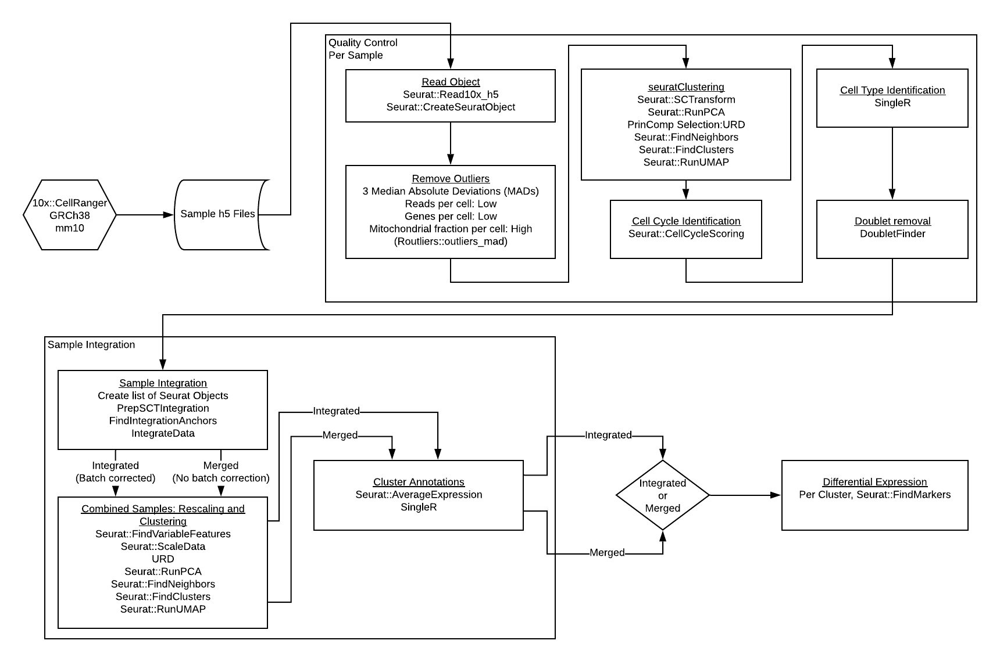

# scRNA-seq Pipeline

## Overview 

An end-to-end pipeline for scRNASeq, beginning from .h5 outputs generated by 10x Genomics Chromium device to Seurat objects of combined samples, and finally differential gene expression (in development). The backbone of the pipeline is Seurat, with additional tools included as needed.

